## Goal

When downloading experimental data from Qualtrics, it is common for the variable showing which condition a person was assigned to to be distributed across different columns: Whether a person was assigned to a certain condition is denoted by a 1 in a respective condition column, whereas that person will have a missing value in the columns that denote assignment to the other conditions (see Figure 1). Our goal is to merge all of these columns into one column with three different values denoting assignment to either condition 1, 2 or 3 (see Figure 2).

Importantly, in this tutorial, we are not saving what we are doing by pasting our operations in the syntax. For reproducibility, this is always recommended because by doing so, we can simply rerun the syntax at a later point in time and do not have to go through all the SPSS menu buttons all over again. For simplicity, however, this tutorial runs all operations by clicking `OK`.

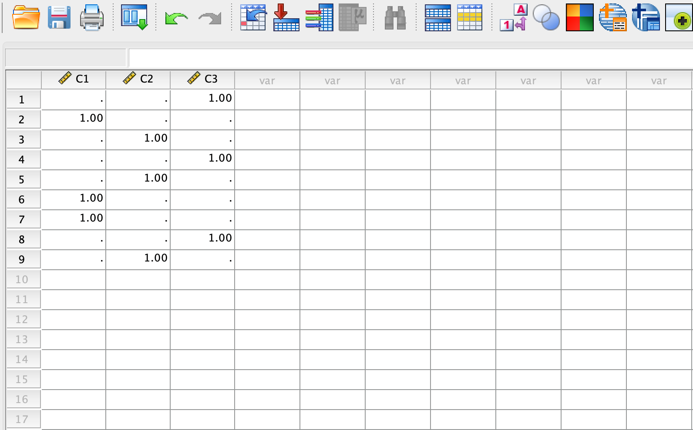{width="500"}

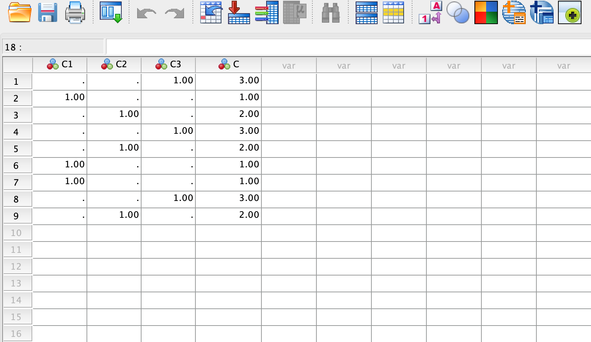{width="500"}

## Step 1 - Recode Condition 1 Into a new Variable

We start by navigating to `Transform` and `Recode into Different Variables...`.

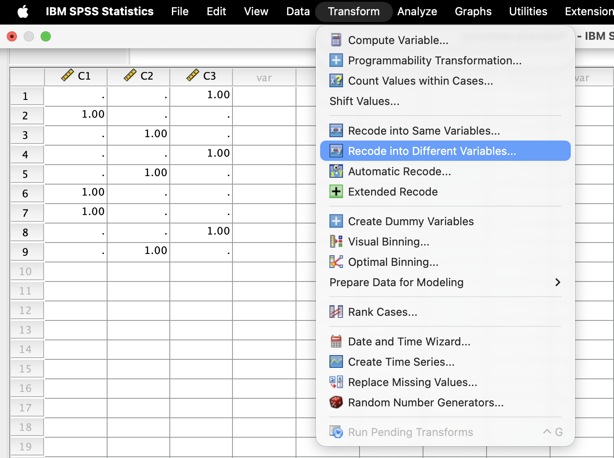{width="500"}

Next, in the left-most box, we select the first condition column C1 and place it in the white box in the middle. We then write the new variable name into `Name:` under `Output Variable`, give it a label, and click on `Change`. Here, the new name C and label C are chosen. Then, we click on `Old and new Values...`.

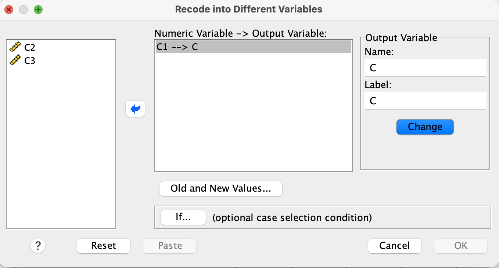{width="500"}

In the old column for condition 1, assignment to condition 1 is denoted by a 1. So we need to type a 1 into the box `Value:` under `Old Value`. On the right, we now need to specify which value condition 1 should have in our new variable C. Let's not over-complicate it and also say 1. Then we need to navigate to the button `Add`.

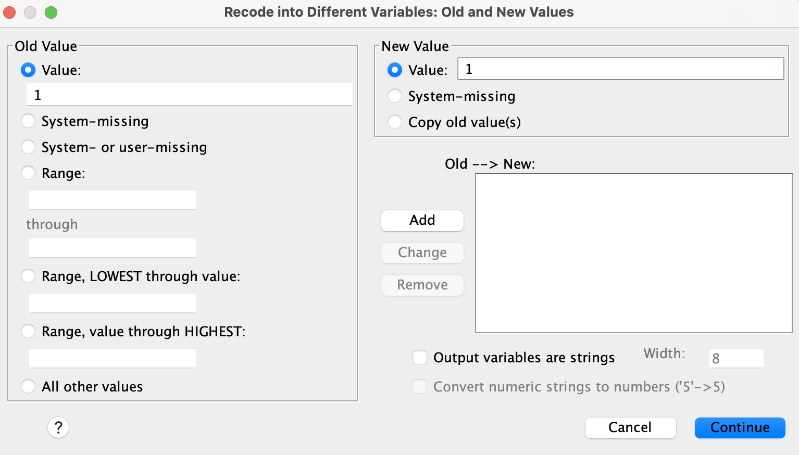{width="500"}

Having clicked `Add`, this should appear (see Figure 6). Click `Continue`.

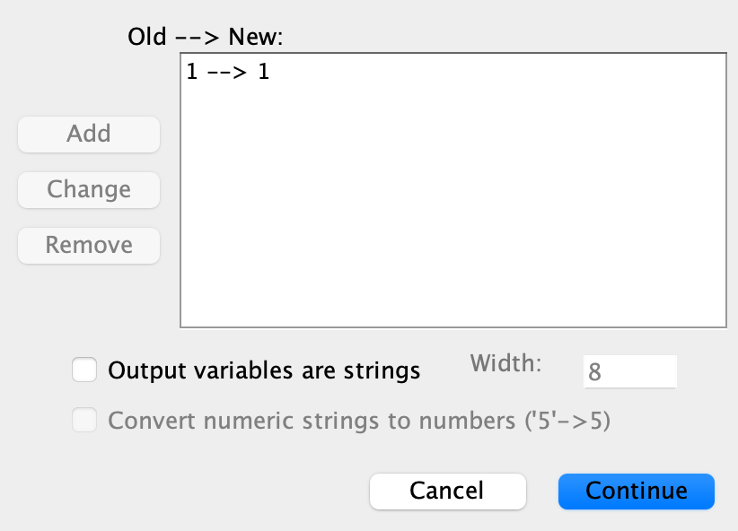{width="500"}

Now we are back in the `Recode into Different Variables...` menu. Click on `OK`.

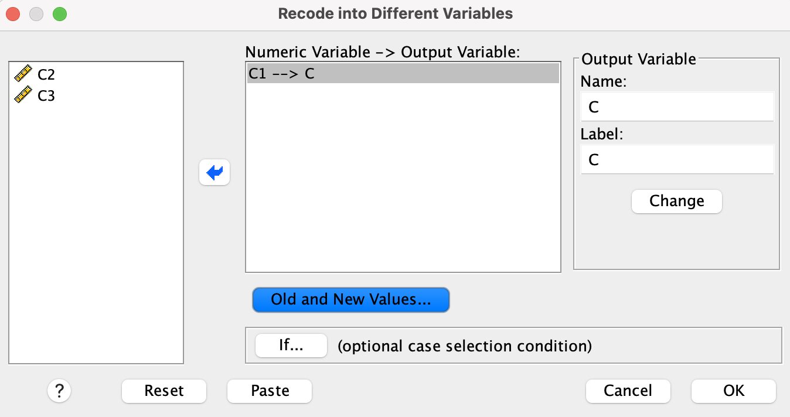{width="500"}

As can be seen in Figure 8, the new condition variable looks now exactly like the column denoting assignment to condition 1. In the next step, we will recode the values in the column for condition 2 into this same new variable C. Note that the variable type for each condition variable and the new one was changed into a nominal variable. I don't really know why, but it is actually a good thing since our condition variable is, in fact, nominal.

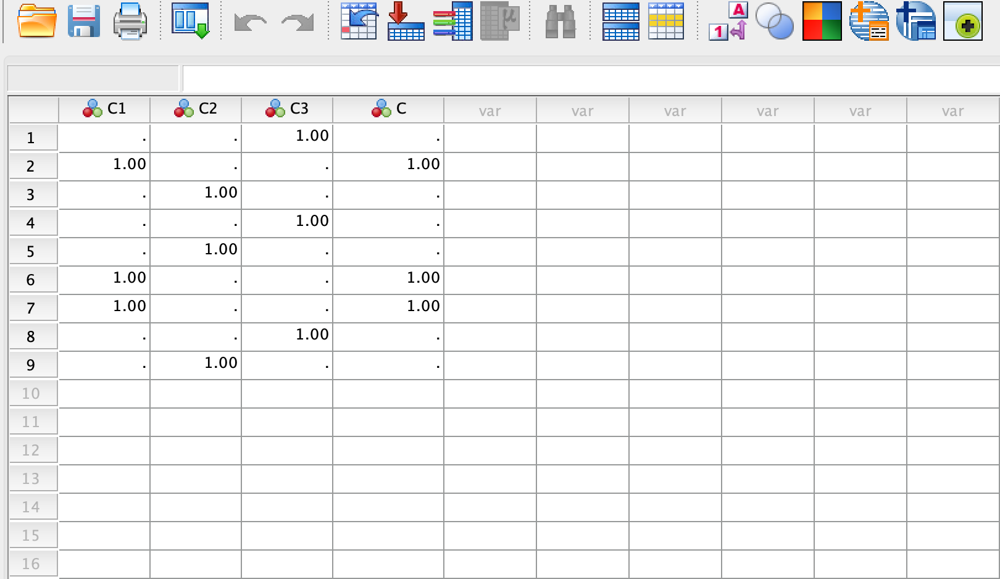{width="500"}

## Step 2 - Recode Condition 2 into C

We now navigate back to the `Recode into Different Variables...` menu.

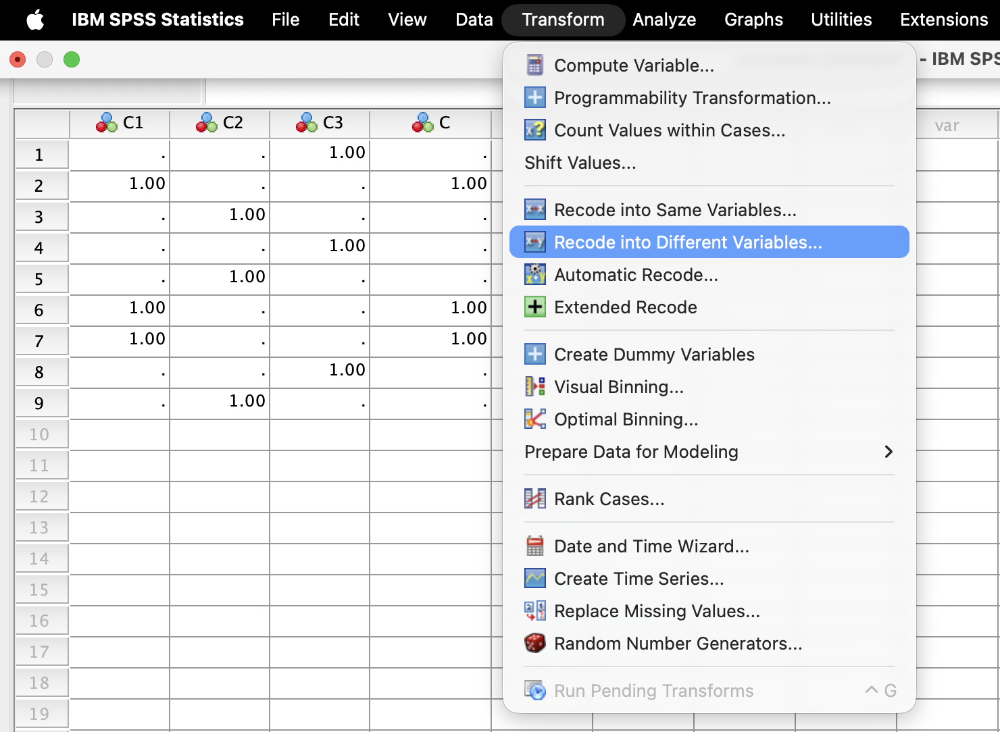{width="500"}

Now we want to recode variable C2 into the same output variable C. When you now click `Change`, a warning message will appear.

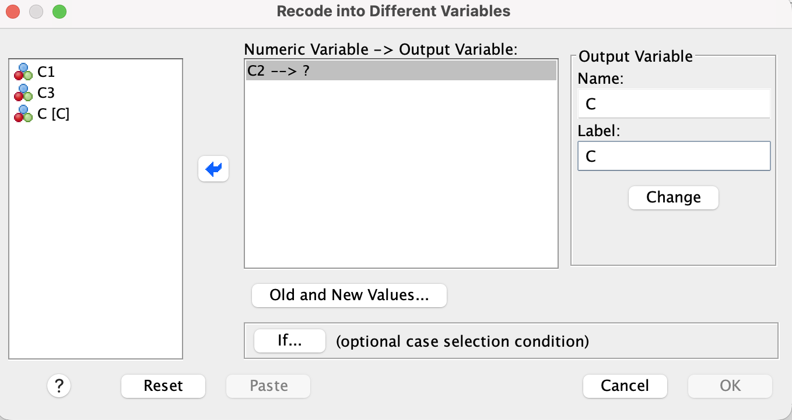{width="500"}

This warning message only tells us that we are writing into a variable that already exists. Since we want this, simply ignore it and click `OK`.

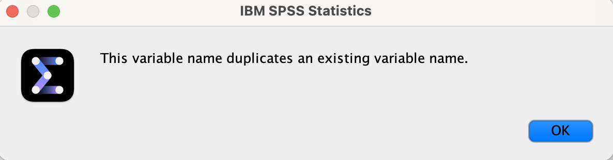{width="500"}

We now need to remove the initial recoding because we do not want the number for the second condition to also be 1 in the new condition variable C - otherwise we would not be able to distinguish between conditions 1 and 2. Simply click on the old recoding and then click the button `Remove`.

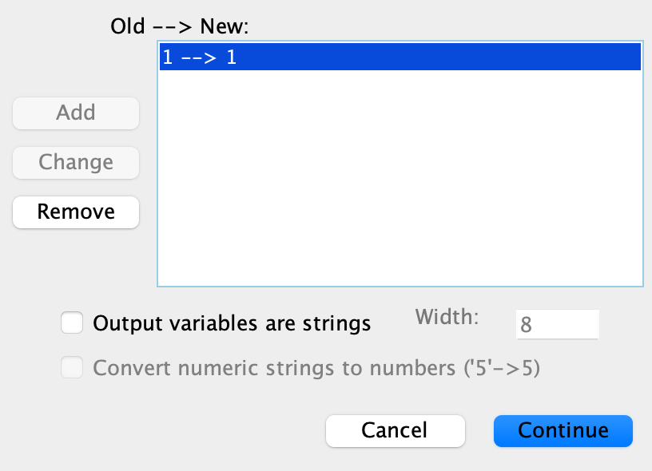{width="500"}

Now indicate that the 1 in the column for condition 2 should become 2 in the new condition variable C. Click on `Continue`

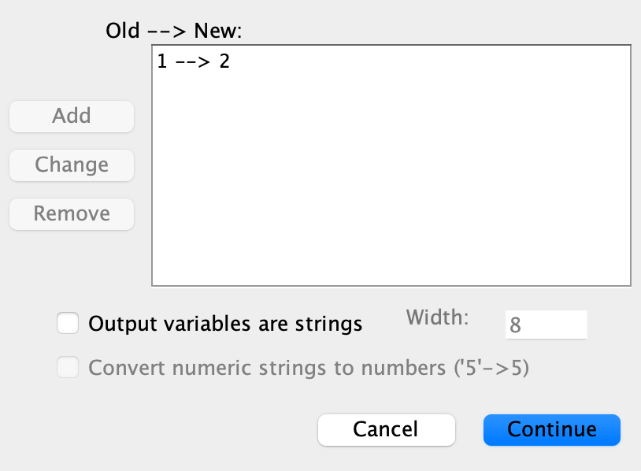{width="500"}

Importantly, we do not want to overwrite the condition 1 values in the new condition variable C. If we were to simply click okay in the `Recode into Different Variables...` menu, the 1's in the new condition variable C would become missing values again. So we only want to recode those values in the new condition variable C that are still empty (or missing). Click on `If...`.

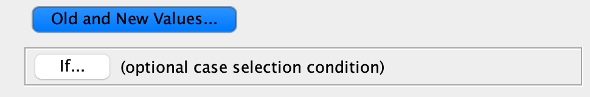{width="500"}

Now select `Include if case satisfies condition:` and then enter `MISSING(C)`. This specifies that we are only overwriting those values in the new variable C that are still 'empty'.

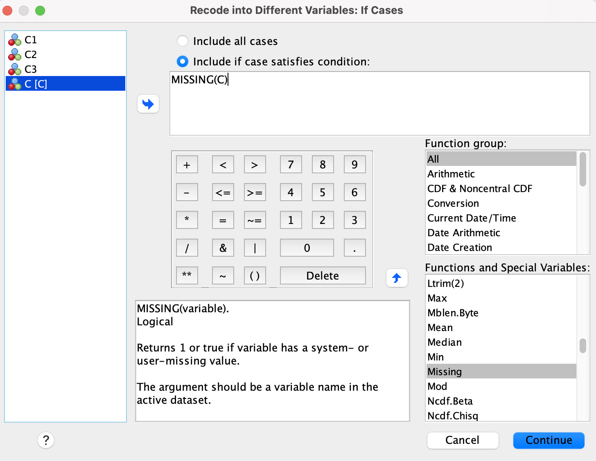{width="500"}

As you can see, the if-condition we specified now appears next to `If...`. Click on `OK`.

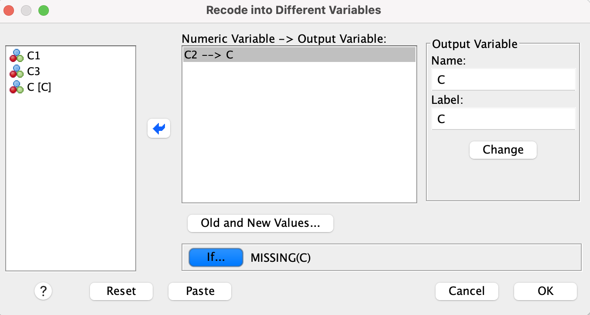{width="500"}

Now we can see that we have come closer to our goal. In the new condition, we can now clearly see how was assigned to condition 1 or condition 2. In a last step, we need to repeat step 2 and recode condition 3 into this new condition variable C.

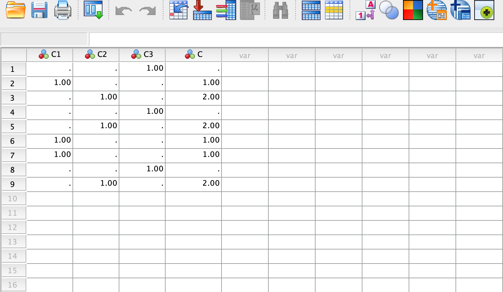{width="500"}

## Step 3 - Recode Condition 3 into C

Finally, repeat step 2 to recode condition 3 values into the new condition variable C.

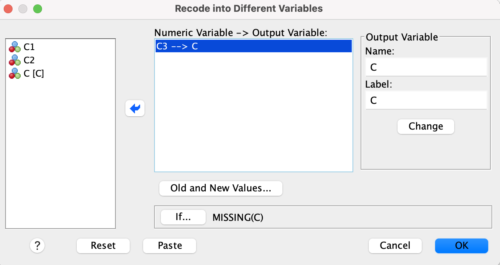{width="500"}

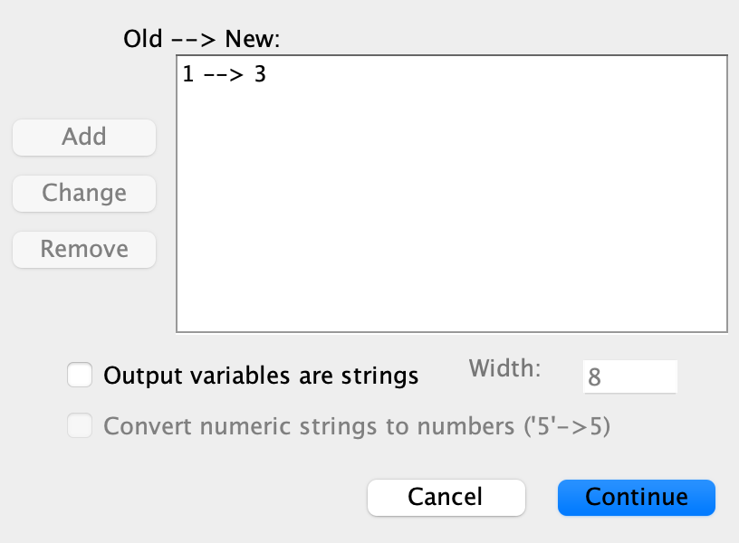{width="500"}

## The Final Result

Violá!

{width="500"}
